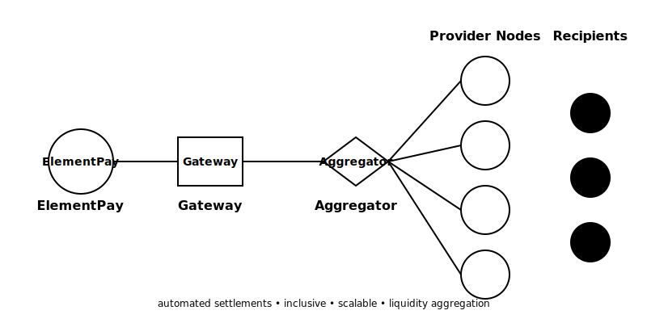

# ElementPay

ElementPay is a cutting-edge onramp/offramp dapp built on Base for the Base Africa Buildathon. Our mission is to bridge the gap between cryptocurrency and local currencies, making digital finance accessible to both newbies and experts across Africa.

## 🛠️ Problem We're Solving

Financial exclusion is a significant issue in many African countries, where access to traditional banking services is limited and costly. Cross-border transactions also face steep fees, making it hard for everyday people to convert their local currencies to crypto or vice versa. ElementPay is focused on solving these local challenges by offering a decentralized, affordable, and simple way to convert local currencies like Mpesa KES into stablecoins, unlocking the power of crypto for everyone in Africa.

## 🚀 Features

- **Seamless Offramp**: Easily convert crypto to local currencies like Mpesa KES.
- **Effortless Onramp**: Convert local currencies to stablecoins using only basename or walletaddress and bank/mobile bank payments.
- **Decentralized Liquidity**: Leverage our decentralized liquidity protocol for efficient transactions.
- **User-Friendly Interface**: Designed for both crypto beginners and experienced users.
- **SmartWallet Integration**: Support for SmartWallets, allowing users to perform secure transactions with ease.
- **Basenames Support**: Simplifies user experience by allowing them to transact with just their basename.

## 🌍 Real-World Use Cases

- **Rural Merchants**: A rural merchant in Kenya can use ElementPay to convert local KES into stablecoins without going through complex exchanges, enabling them to pay suppliers abroad without worrying about currency fluctuations.
- **Cross-border Payments**: Families in different African countries can effortlessly send and receive remittances by converting between their local currency and stablecoins at low fees, bypassing traditional money transfer services.
- **Small Businesses**: Small businesses can now accept stablecoins as payment from international customers, making international trade accessible.

## 💸 Why Choose ElementPay?

- **Low-Cost Transactions**: Our decentralized liquidity protocol ensures that users pay minimal fees when converting between crypto and local currencies. This makes ElementPay the most affordable solution for financial transactions in Africa.
- **Instant Conversions**: Whether you're using Mpesa or a traditional bank, transactions are processed in real-time, ensuring your funds are available immediately.
- **Mobile Banking Integration**: Integrated with popular mobile banking platforms such as Mpesa, allowing users to easily switch between local currencies and stablecoins.

## 🌱 Future Growth & Scalability

ElementPay has the potential to expand across multiple African countries, enabling the seamless conversion of regional currencies into stablecoins. With ongoing partnerships and continuous updates to our decentralized liquidity protocol, ElementPay can scale to support millions of users, bridging the gap between fiat and crypto in Africa.

## 🌐 Localization & Accessibility

- **Multilingual Support**: ElementPay will offer localized versions of the app in Swahili and other major African languages, ensuring inclusivity for all users.
- **Easy Onboarding**: We understand the need for simplicity. That’s why ElementPay offers an intuitive user interface, making it easy even for those new to crypto to get started with just a phone number, Basename and SmartWallet.


## Getting Started

To run elements pay follow this steps:
```bash
git clone https://github.com/element-pay/element
cd element
npm install
npm run dev
```

Don't forget to fill in the necessary variables in the `.env.local` file according to the template provided in [`.env.example`](.env.example).

Then, visit [http://localhost:3000](http://localhost:3000) to start using element pay

### Element is built on baseflow Protocol

| Before      | Now |
| ----------- | ----------- |
| |


| ELEMENT PAY




## ⚠️ Disclaimer Notice

This application is for demo use only. Any transactions conducted within this app are for illustrative purposes.

Therefore:

While the app records real transactions, please exercise caution and do not use this app as is in a production environment. Use at your own risk. Element pay is  not responsible for any issues or damages that may arise from the use of this app.

